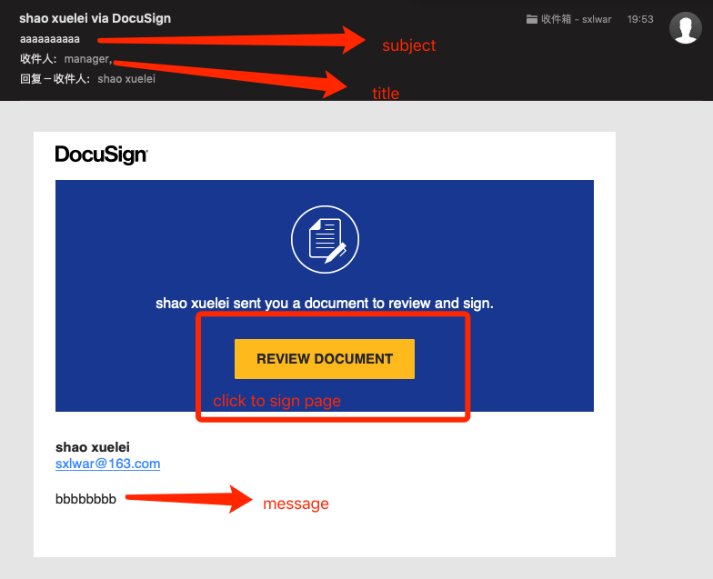
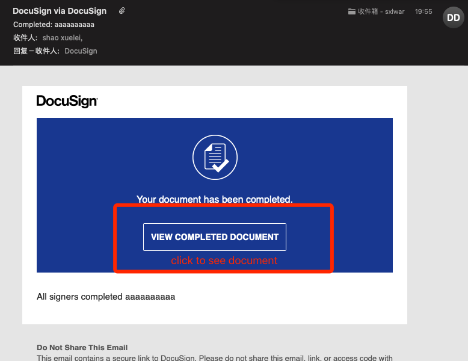
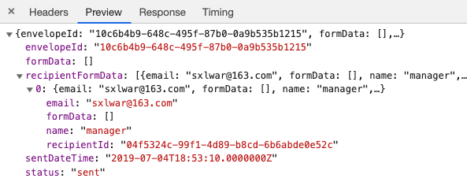
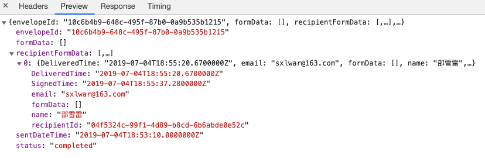

# DOCUSIGN DEMO

## IMPORTANT

**When starting this project, ACCESS_TOKEN in the env file in the config directory maybe expired. You need to get your own ACCESS_TOKEN from [docusign](https://developers.docusign.com), remember to replace the ACCOUNT_ID with your own id too.**

## REPO

Note that the link given by the official website may points to an old repo, which corresponds to version 4.0. There is a package called docusign in [npm](https://www.npmjs.com/package/docusign), it has been deprecated. Download the latest package called docusign-esign.

docusign is developed by JavaScript, so far, the official has **not** written its declaration files. You can write your own declaration file if you mind for happy coding.

## QUESTIONS

Q1: How do I access the Docusign documents that I signed? **Users care**

> seem detail [here](https://support.docusign.com/en/articles/How-do-I-access-the-DocuSign-documents-that-I-signed)

Q2: How do I access the Docusign documents that user signed? **Developer care**

> Developer can get the document by [EnvelopeFormData](https://developers.docusign.com/esign-rest-api/reference/Envelopes/EnvelopeFormData/get) api. The api needs two parameters, accountId and envelopedId. AccountId is the same as ACCOUNT_ID in env configuration. EnvelopedId is returned by createEnvelope method which used to send an email to user.

## Run

### Start server

- dev

After clone this repo, cd backend directory

```bash
npm install
```

In backend directory, run:

```bash
npm run start:dev
```

- build

```bash
npm run build
```

- bundle

```bash
npm run webpack
```

Run command above to package the project, automatically replace when file changes in backend/src/ directory.

### Start frontend

cd frontend directory

- dev

```bash
npm install
npm run start
```

Project will running at localhost:3001

- build

```bash
npm run build
```

## Preview

After the email is successfully sent, signers will see below in their mailbox.

;

After signed, docusign will sent another email to signer, like this:

;

If try to get the document before user sign it, response looks like this:

;

If try to get the signed document, response looks like this:

;
